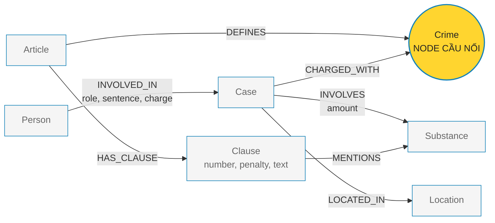
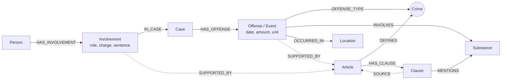

# Thiết kế Ontology — Day 19

**Họ tên:** Phạm Quang Đạt  **MSSV:** 2A202602704

**Lựa chọn** (đánh dấu một):
- [x] Dùng ontology gợi ý (có thể chỉnh nhỏ)
- [ ] Tự thiết kế (xét bonus +15, xem `SUBMISSION.md`)

> Hướng dẫn: `LAB_GUIDE.md` Bước 2. Thiết kế chính dưới đây giữ nguyên ontology gợi ý để tương thích với các hàm và truy vấn đã có trong `src/graph.py`.

## 1. Sơ đồ

`Crime` là **node cầu nối** giữa KB tin tức và KB luật.

## 2. Entity types (node labels)

| Label | Ý nghĩa | Khóa định danh (`MERGE` theo) | Properties | Lấy từ KB nào | Trích bằng (regex / LLM / khác) |
| --- | --- | --- | --- | --- | --- |
| `Article` | Điều luật hoặc điều khoản lớn trong văn bản pháp luật | `id` | `title`, `law`, `doc_id` | Luật | Regex và metadata của `Document` |
| `Clause` | Khoản cụ thể của một điều luật, chứa khung hình phạt và nội dung | `id` | `number`, `penalty`, `text`, `doc_id` | Luật | Regex |
| `Crime` | Tội danh chuẩn hóa; node cầu nối giữa hai KB | `name` | `name` | Cả hai KB | Luật: regex; tin: LLM rồi `link_entity` |
| `Case` | Vụ việc được mô tả trong một bài báo | `name` | `summary`, `date`, `doc_id`, `source_title` | Tin tức | LLM |
| `Person` | Người liên quan đến vụ việc | `name` | `aliases` | Tin tức | LLM |
| `Substance` | Chất ma túy được nhắc đến | `name` | `name` | Cả hai KB | Luật: regex; tin: LLM |
| `Location` | Địa điểm liên quan đến vụ việc | `name` | `name` | Tin tức | LLM |

Các node tài liệu chính như `Article`, `Clause` và `Case` mang `doc_id`. Các node dùng chung như `Crime`, `Substance`, `Person` và `Location` được `MERGE` theo khóa định danh và có thể không có `doc_id`.

## 3. Relationships

| Type | Từ → Đến | Properties trên cạnh | Ý nghĩa |
| --- | --- | --- | --- |
| `DEFINES` | `Article → Crime` | — | Điều luật quy định tội danh |
| `HAS_CLAUSE` | `Article → Clause` | — | Điều luật được tách thành các khoản |
| `MENTIONS` | `Clause → Substance` | — | Khoản luật nhắc đến chất hoặc ngưỡng khối lượng |
| `INVOLVED_IN` | `Person → Case` | `role`, `charge`, `sentence` | Người và vai trò của người đó trong vụ án |
| `CHARGED_WITH` | `Case → Crime` | — | Vụ án bị truy tố hoặc xét xử về tội danh nào |
| `INVOLVES` | `Case → Substance` | `amount` | Vụ án liên quan đến chất và khối lượng nào |
| `LOCATED_IN` | `Case → Location` | — | Địa điểm của vụ việc |

## 4. Node cầu nối giữa 2 KB

- **Node nào:** `Crime` (tội danh).
- **Vì sao chọn node này:** KB luật định nghĩa tội danh qua `Article -[:DEFINES]-> Crime`, còn KB tin tức gắn vụ án với tội danh qua `Case -[:CHARGED_WITH]-> Crime`. Vì vậy có thể đi từ người hoặc vụ án trong tin tức sang điều luật tương ứng.
- **Cách đảm bảo hai phía khớp tên:** lấy danh sách tội danh chuẩn từ KB luật, đưa danh sách đó vào prompt trích xuất tin; sau đó chuẩn hóa cả tên từ tin và tên chuẩn bằng `normalize_crime`, rồi dùng `link_entity` để trả về đúng giá trị gốc trong danh sách chuẩn.
- **Khi nào cầu gãy, và bạn xử lý thế nào:** cầu gãy khi LLM ghi sai tội danh, dùng từ đồng nghĩa quá khác hoặc không có tội danh tương ứng trong Điều luật. Khi đó không tự đoán; `link_entity` trả về `None`, ghi nhận vụ án chưa nối được và kiểm tra lại prompt, alias hoặc ngưỡng fuzzy matching.

## 5. Competency questions

Các pattern dưới đây mô tả đường đi logic; khi chạy thực tế có thể thêm điều kiện `doc_id`, tên, chất hoặc số điều tương ứng.

| Câu | Đường đi (Cypher pattern) | Trả lời được? |
| --- | --- | --- |
| Q1 | `(:Article)-[:HAS_CLAUSE]->(:Clause)`; lọc điều luật có tiêu đề hoặc nội dung chứa “tiền chất”, rồi lấy `Clause.text`/`Clause.penalty`. | Có, nếu văn bản Luật Phòng, chống ma túy 2021 đã được nạp vào KB luật. |
| Q2 | `(:Person)-[r:INVOLVED_IN {sentence: ...}]->(:Case)`; lọc `Case` theo vụ TAND TP.HCM ngày 28-9 và lấy những người có `sentence` là tử hình. | Có. Đây là truy vấn một bước trong KB tin tức. |
| Q3 | `(:Person)-[:INVOLVED_IN {sentence: ...}]->(:Case)-[:CHARGED_WITH]->(:Crime)<-[:DEFINES]-(:Article)-[:HAS_CLAUSE]->(:Clause)`; lọc người Lê Minh Thành và giữ khoản 1 để lấy 36 tháng, Điều 251 và khung 02–07 năm. | Có. |
| Q4 | `(:Case)-[:CHARGED_WITH]->(:Crime)<-[:DEFINES]-(:Article)-[:HAS_CLAUSE]->(:Clause)`; lọc vụ Hoàng Nato, tội tổ chức sử dụng trái phép chất ma túy và Điều 255, rồi lấy khoản có mức tối đa hoặc tù chung thân. | Có. |
| Q5 | `(:Case)-[:CHARGED_WITH]->(:Crime)<-[:DEFINES]-(:Article)-[:HAS_CLAUSE]->(:Clause)-[:MENTIONS]->(:Substance)` và đồng thời `(:Case)-[r:INVOLVES]->(:Substance)`; lọc Cái Quang Huy, MDMA, khối lượng `r.amount`, rồi chọn khoản 4 Điều 250. | Có, với điều kiện dữ liệu trích xuất giữ được chất và khối lượng. |
| Q6 | `(:Person)-[:INVOLVED_IN]->(:Case)-[:INVOLVES]->(:Substance {name:'MDMA'})`; gom nhóm theo `Case`, lấy người liên quan, tóm tắt, khối lượng và địa điểm. | Có. Đây là truy vấn tổng hợp nhiều vụ trong KB tin tức. |

## 6. Quyết định thiết kế và đánh đổi

1. **Chọn `Crime` làm node cầu nối.** Phương án khác là nối trực tiếp `Case` với `Article`, nhưng sẽ làm mất lớp ngữ nghĩa tội danh và khó xử lý một vụ có nhiều tội. Chọn `Crime` vì cả hai KB đều có thông tin tội danh và code gợi ý đã hỗ trợ liên kết này.
2. **Biểu diễn khối lượng trên cạnh `INVOLVES`, không tạo node `Quantity`.** Cách này giữ graph nhỏ và đủ cho Q5–Q6. Đổi lại, việc so sánh nhiều đơn vị hoặc lưu nhiều lần cân trong cùng vụ sẽ kém linh hoạt.
3. **Tách `Article` và `Clause`.** Nếu chỉ lưu toàn bộ điều luật ở một node thì không truy ra chính xác khoản 1, khoản 4 và khung hình phạt tương ứng. Đổi lại, graph có nhiều node và cần regex ổn định hơn.
4. **Dùng tên chuẩn làm khóa cho thực thể dùng chung.** `MERGE` theo `Crime.name`, `Substance.name` và các tên tương ứng giúp nối nhiều tài liệu. Đổi lại, tên do LLM tạo có thể gây trùng thực thể, nên phải chuẩn hóa và dùng `link_entity` trước khi ghi graph.

## 7. So với ontology gợi ý

| Điểm khác | Gợi ý làm gì | Bạn làm gì | Vấn đề nó giải quyết | Bằng chứng (Cypher, hoặc số liệu benchmark) |
| --- | --- | --- | --- | --- |
| Không thay đổi schema chính | Dùng `Article`, `Clause`, `Crime`, `Case`, `Person`, `Substance`, `Location` | Giữ nguyên để tương thích với `src/graph.py` | Giảm rủi ro KG-2/KG-3 không khớp code | Các pattern Q3–Q6 dùng trực tiếp các label và relationship trong code gợi ý |
| Làm rõ node cầu nối | Dùng `Crime` nối hai KB | Đánh dấu `Crime` trong sơ đồ và mô tả quy trình `link_entity` | Tránh tách rời vụ án và điều luật do khác cách viết tội danh | `Person → Case → Crime ← Article` |

## 8. Hạn chế còn lại

- `Case` và `Person` đang dùng tên do LLM trích xuất làm khóa nên vẫn có thể bị trùng hoặc tách thành nhiều node.
- `Substance` chưa có bảng alias đầy đủ; các cách viết như “ma túy tổng hợp”, “MDMA” hoặc tên thương mại có thể chưa được gộp đúng.
- Khối lượng và ngưỡng pháp lý chủ yếu nằm trong property hoặc văn bản khoản luật, chưa được mô hình hóa thành node `Quantity`/`Threshold`, nên truy vấn định lượng phức tạp còn hạn chế.
- Ontology chưa biểu diễn đầy đủ các giai đoạn tố tụng như bắt, truy tố, xét xử và phúc thẩm.

## 9. Phương án cân nhắc 2 — mô hình mở rộng theo sự kiện

Đây là bản thiết kế mở rộng được cân nhắc nhưng **không dùng để triển khai trong LAB này**. Nó tách vai trò của người và hành vi phạm tội thành các node sự kiện, phù hợp hơn nếu cần lưu nhiều lần tham gia, nhiều hành vi hoặc provenance chi tiết.

**Ưu điểm:** mô hình hóa được nhiều sự kiện và vai trò riêng biệt, dễ mở rộng provenance. **Nhược điểm:** khác xa schema hiện tại, cần viết lại extractor, Cypher ghi graph và `context()`, nên không chọn cho bài LAB hiện tại.
